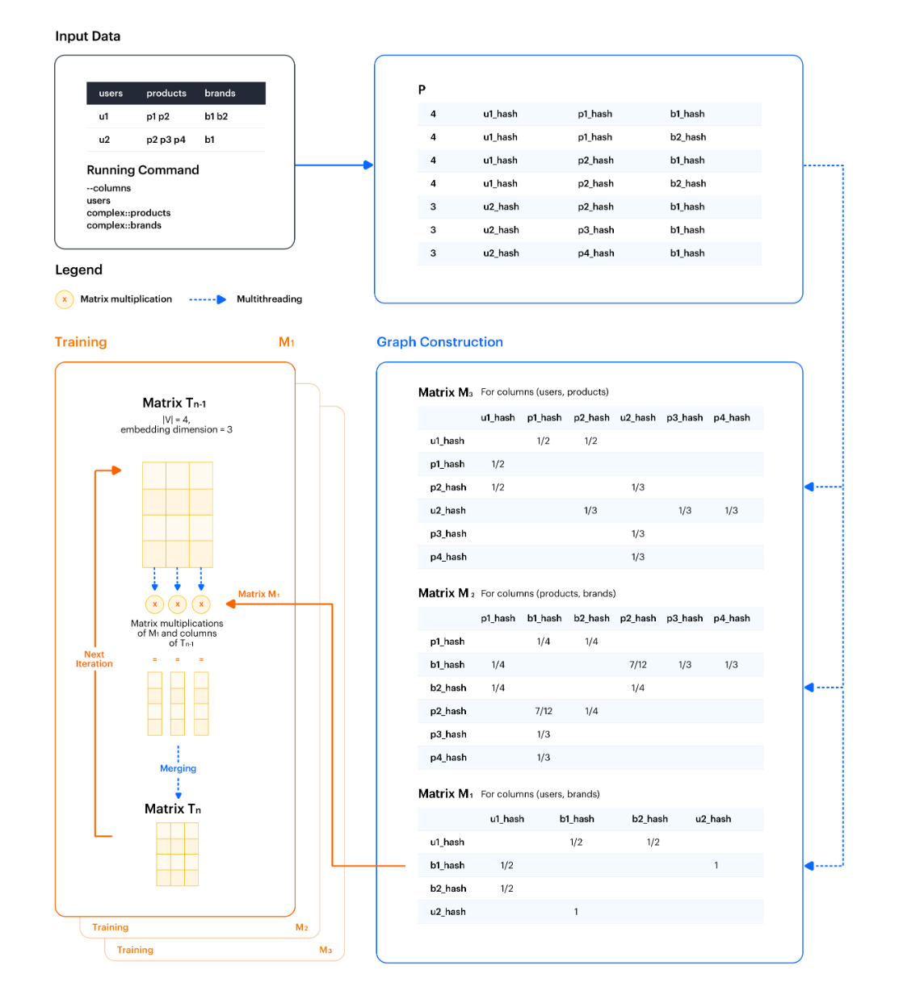

Cleora is a general-purpose model for efficient, scalable learning of stable and inductive entity embeddings for heterogeneous relational data. Cleora embeds entities in n-dimensional spherical spaces utilizing extremely fast stable, iterative random projections, which allows for unparalleled performance and scalability.

Types of data which can be embedded include for example:

- heterogeneous undirected graphs
- heterogeneous undirected hypergraphs
- text and other categorical array data
- any combination of the above


## Cleora's input

Cleora is built as a multi-purpose "just embed it" tool, suitable for many different data types and formats. 
Our tool ingests relational tables with different types of entities, e.g., a table storing information about user id and url of a visited page. 
The table can contain categorical columns with:

- a single value
- an array of values

Cleora algorithm will represent this table as undirected heterogeneous hypergraph:

- undirected — edges have no direction, they represent two-way relationships 
- heterogeneous — it contains multiple types of nodes and/or edges, example edges: users, products, pages, ATMs, social media posts; example relations: buy, view, liked, store, recieve
- hypergraph — in hypergraph edge can connect any number of nodes (for details see [Hypergraph Expansion Methods](hypergraph_expansion.md))

**Example:** 

Consider table representing shopping baskets.

Table contains following columns:

`user <\t> product <\t> store`

The input file contains values for each column:

`user_id <\t> product_id product_id product_id <\t> store_id`

In this example, every column has a type. This way we can determine if identifiers in the columns points to different or the same entity. It is possible for two columns to share a type, then the same identifier in both columns will point to the same entity. This is the case for homogeneous graphs:

`user <\t> user`


Based on the column format specification, Cleora performs:

- decomposition of hyperedges (see [Hypergraph Expansion Methods](hypergraph_expansion.md))
- Creation of pairwise graphs for all pairs of entity types
- Embedding of each graph

**Output:**
The final output of Cleora consists of multiple files for each (undirected) pair of entity types in the table.

## Graph construction




*To understand running command and for other Cleora configuration option see section [Cleora configuration](configuration.md)*


Graph construction starts with the creation of a helper matrix *P* as a regular 2-D Rust array, which is built according to the selected expansion method (for details see section [Hypergraph expansion methods](hypergraph_expansion.md)).  
The example in the figure above, presents Cleora algorithm with clique expansion method. In clique expansion each node is connected with any other node in the same row. Hence, a Cartesian product (all combinations) of all columns is created.  
Additionally, each entity identifier from the original input file is hashed with [xxhash](https://cyan4973.github.io/xxHash/) - a fast and efficient hashing method. It allows us to store identifiers in a unified, small data format. 

From the first row of input data table example:

```
U1 P1 P2 B1 B2
```

we get 4 combinations:

```
[4, U1hash, P1hash, B1hash]
[4, U1hash, P1hash, B2hash]
[4, U1hash, P2hash, B1hash]
[4, U1hash, P2hash, B2hash]
```

At the beginning, we insert the total number of combinations (in this case 4). Then we add another 3 combinations from the second row of the input.  

Each pair in `P` represents a different type of relation, for example, user bought product, product has a brand, user bought something from a brand. For each such pair of columns we create a separate matrix `M` as a `SparseMatrix` (the matrices `M` will usually hold mostly zeros). Each matrix `M` is produced in a separate thread in a stepwise fashion. The rows of matrix `P` are broadcasted to all matrix `M` objects, and each matrix `M` object reads the buffer selecting the appropriate values, updating its content.   
**For example:** Matrix M3 (users and products) reads the hashes from column 1 storing hashes of user ids and column 2 storing hashes of product ids. After reading the first vector:

```
[4, U1hash, P1hash, B1hash]
```

the edge value for **U1hash <-> P1hash** equals 1/4 (1 divided by the total number of Cartesian products). After reading the next vector:

```
[4, U1hash, P1hash, B2hash]
```

the edge value for **U1hash <-> P1hash** updates to 1/2 (1/4 + 1/4). After reading the next two, we finally have:

**U1hash <-> P1hash** = 1/2

**U1hash <-> P2hash** = 1/2

For maximum efficiency, we created a custom implementation of a sparse matrix data structure - the SparseMatrix struct. It follows the sparse matrix coordinate format (COO). Its purpose is to save space by holding only the coordinates and values of nonzero entities.  

## Training embeddings

The constructed graph is used to compute node embeddings representing entities in the graph (here users, products, brands).
Embeddings training proceeds separately for each matrix M:

- 2-D array is initilized — matrix T0, which is our embedding matrix.  
- the matrix M is then multiplied by T0 to create a new matrix T1
- T1 matrix is L2-normalized 
Depending on the target number of iterations the T1 matrix object is either returned as program output and printed to file, or fed for next iterations of multiplication against the matrix M object.     

Matrix multiplication against each column of matrix T is done in a separate thread. The obtained columns of the new matrix
T are subsequently merged into the full matrix. Similarly, L2-normalization is performed in multithreaded fashion across matrix columns.  

## Memory consumption

Every **SparseMatrix** object allocates space for:

- **|V|** objects, each occupying 40 bytes,
- **2 x |E|** objects (in undirected graphs we need to count an edge in both directions), each occupying 24 bytes.

During training, we need additional: 


$$ 2 × d × | V | $$


objects, each occupying 4 bytes (this can be avoided by using memory-mapped files, see `--in-memory-embedding-calculation` argument for the program).
