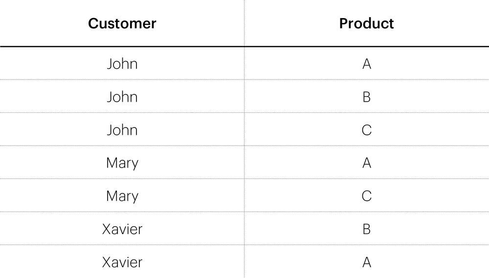
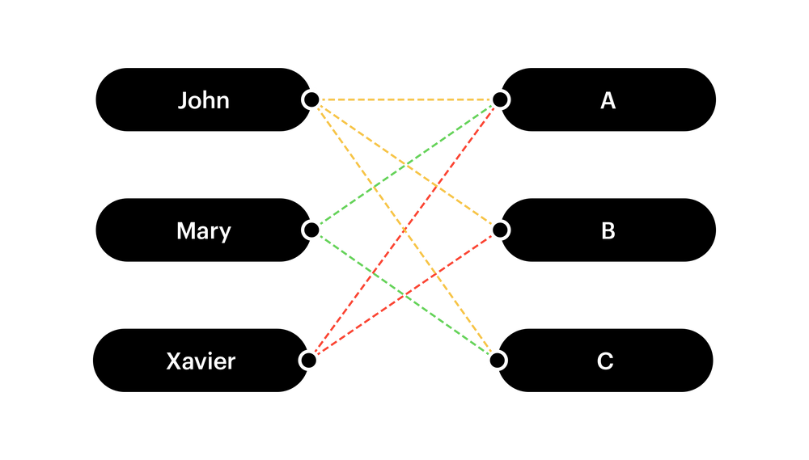
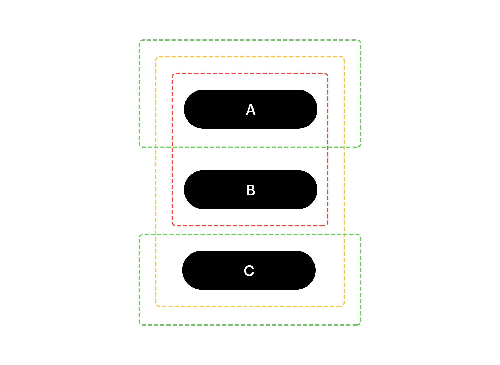
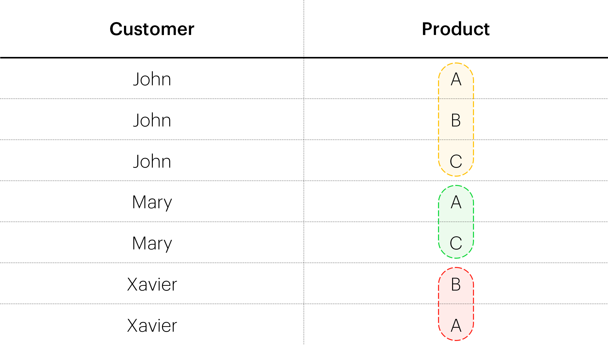
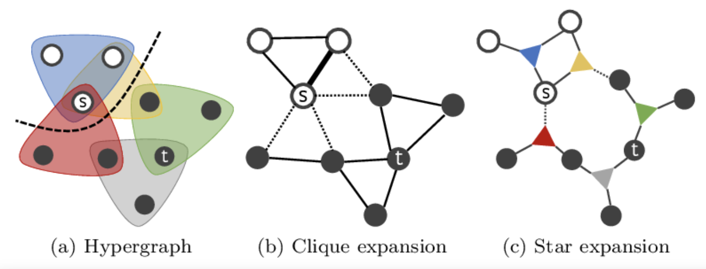
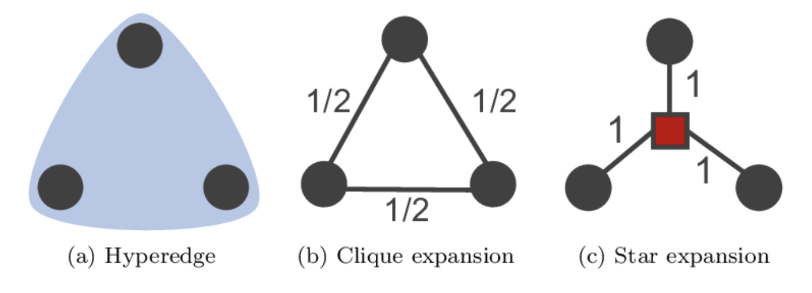

# Graphs vs Hypergraphs

To understand the difference between a graph and a hypergraph, let’s consider a very simple example of a relational table:

It can be represented as a graph, with vertices (John, Mary, Xavier, A, B, C) as follows:

The edges of the graph correspond 1–1 to the rows in the table, e.g., (John , A), (Mary , C).

However, this data also contains hypergraphs. Let’s treat customers as generalized edges instead:

We’ve taken products (A, B, C) as vertices, and treated customers (John, Mary, Xavier) as hyperedges. We can think of this as a simple “group by” operation, where we group the products by the customers. It may be easier to visualize the hyperedges in the actual table:

So we have 3 hyperedges: (A, B, C), (A, C), and (B, A). Notice the first hyperedge has cardinality 3 — it spans 3 different vertices. This illustrates the 'hyper' aspect of a hypergraph — edges can span more than 2 vertices. We could have done the grouping the other way around (group customers by products), which would result in yet another hypergraph.

# Hypergraph Expansion

Cleora needs to break down all existing hyperedges into edges as the algorithm relies on the pairwise notion of node transition. Hypergraph expansion to graph is done using two alternative strategies:

## Clique Expansion

- Each hyperedge is transformed into a clique - a subgraph where each pair of nodes is connected with an edge. The space/time complexity of this approach is:

  $$ O(|V| \times d + |E| \times k^2) $$

  where |*E*| is the number of hyperedges and *k* is the maximal width of hyperedge from the hypergraph.

  With the usage of cliques, the number of created edges can be significant but guarantees better fidelity to the original hyperedge relationship. We apply this scheme to smaller graphs.

## Star Expansion

- An extra node is introduced which links to the original nodes contained by a hyperedge. The space/time complexity of this approach is:

  $$ O((|V|+|E|) \times d + |E|k) $$

  Here, we must take into account the time and space required to embed an extra entity for each hyperedge, but we save on the number of created edges, which would be only *k* for each hyperedge. This approach is suited for large graphs.

